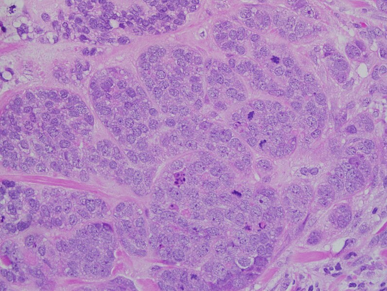
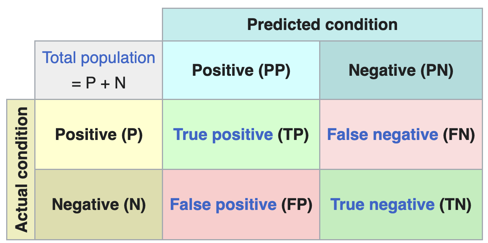
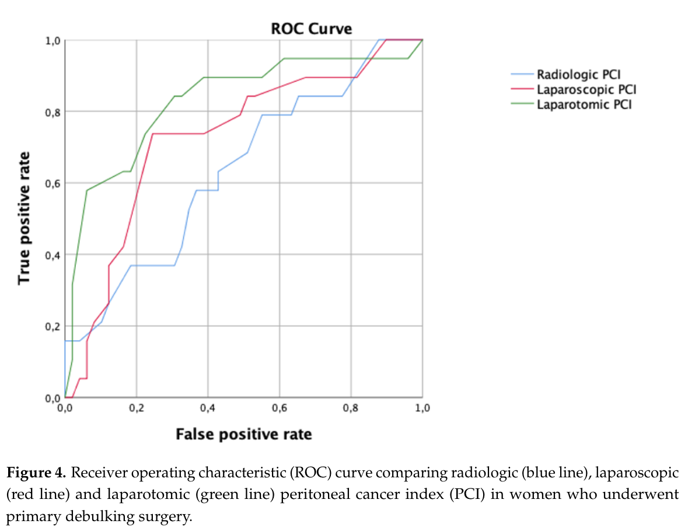
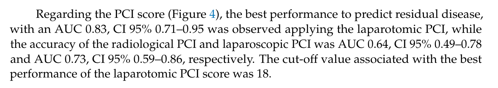

# Logistic regression and classification

```{r}
#| include: false
library(tidyverse)
library(gridExtra)
library(caret)
library(scales)
library(pROC)

bdiag <- read_csv("datasets/02-logistic-regression/bdiag.csv") |>
  mutate(diagnosis = as.factor(diagnosis),
         diagnosis_binary = ifelse(diagnosis == "B", 0, 1))
```

In the previous chapters, the outcome variable was always continuous: body fat percentage, CWD basal area, and so on. In many problems, however, the outcome is a **categorical** variable. For example, we might want to figure out whether a genetic mutation is deleterious (yes/no) based on DNA sequencing data, predict the outcome of surgery (success/failure) for patients with ovarian cancer based on patient characteristics, or classify iris varieties given the dimensions of their leaves. These problems are examples of **classification** problems, and they require different techniques than the regression methods we have seen so far.

There are many techniques for classification, including logistic regression, K-nearest neighbors, linear discriminant analysis, support vector classification, decision trees, and neural networks, each with their own advantages and disadvantages. In this chapter, we will focus on **logistic regression** and **K-nearest neighbors** (KNN). The main reference for this chapter is *An Introduction to Statistical Learning* (@jamesIntroductionStatisticalLearning2021, sections 4.1--4.3).

## Dataset {#sec-bdiag-dataset}

Throughout this chapter, we will use the Wisconsin breast cancer diagnostic dataset (`bdiag`), described in @1993-street-NuclearFeatureExtraction. This dataset contains measurements on cell nuclei from 569 tumor samples, each classified as either malignant (M) or benign (B). The features we will use are the mean radius of the cell nucleus and the texture, defined as the variance of gray-scale values in the cell image.

{#fig-ductal-carcinoma}

We split the dataset into a training set (80% of the data) and a test set (20%), so that we can later evaluate how well our models generalize to unseen data.

```{r}
#| code-fold: show
set.seed(1234)

train_size <- 0.80 * nrow(bdiag)
train_ind <- sample(seq_len(nrow(bdiag)),
                    size = train_size)

train <- bdiag[train_ind, ]
test <- bdiag[-train_ind, ]
```

A first look at the data reveals that malignant tumors tend to have a larger mean radius and a somewhat higher texture than benign tumors, though the two classes overlap considerably.

```{r}
#| label: fig-bdiag-first-look
#| fig-cap: "Scatter plot of the breast cancer diagnostic dataset, with box plots for the two features. Malignant tumors tend to have a larger radius and higher texture."
#| fig-align: center

p_scatter <- ggplot(train,
                    aes(x = radius_mean, y = texture_mean, color = diagnosis)) +
  geom_jitter() +
  theme(legend.position = "top")

p_box_radius <- ggplot(train,
                       aes(y = radius_mean, x = diagnosis, fill = diagnosis)) +
  geom_boxplot(show.legend = FALSE) +
  ggtitle("radius") + xlab("") + ylab(NULL)

p_box_texture <- ggplot(train,
                        aes(y = texture_mean, x = diagnosis, fill = diagnosis)) +
  geom_boxplot(show.legend = FALSE) +
  ggtitle("texture") + xlab("") + ylab(NULL)

grid.arrange(p_scatter, p_box_radius, p_box_texture, nrow = 1, widths = c(2, 1, 1))
```


## K-nearest neighbors classification

Before turning to logistic regression, we consider a simpler classification method: K-nearest neighbors (KNN). The idea is straightforward: to classify a new observation $x$, find the $K$ nearest data points in the training set and assign $x$ to the class that is most common among those neighbors.

{#fig-knearest}

More precisely, KNN estimates the probability that $x$ belongs to class $y$ as
$$
  P(Y = y \mid X = x) = \frac{1}{K} \sum_{i = 1}^{K} I(y_i = y),
$$
where the sum is over the $K$ data points $y_1, \ldots, y_K$ that are nearest to $x$, and $I(y_i = y)$ equals 1 if $y_i = y$ and 0 otherwise. For example, in @fig-knearest, with $K = 5$ neighbors, the estimated probabilities are $P(Y = B \mid X = x) = 3/5 = 60\%$ and $P(Y = M \mid X = x) = 2/5 = 40\%$.

KNN has a number of attractive properties: it requires no explicit training phase, is robust to outliers, and can easily handle more than two classes. On the other hand, it is not very interpretable: it is hard to understand *why* a particular classification was made. KNN also tends to be relatively memory-intensive, since all training data must be stored in memory when making predictions.

The plot below shows the decision boundary for a KNN classifier with $K = 5$ on the breast cancer dataset. The background color indicates the predicted class at each point, with the intensity reflecting the confidence of the prediction. The points of the decision boundary have equal probability of belonging to either class.

```{r}
#| label: fig-knn-decision-boundary
#| fig-cap: "Decision boundary for the KNN classifier with $K = 5$."
#| fig-align: center

model_knn_5 <- knn3(diagnosis ~ radius_mean + texture_mean, data = train, k = 5)

model <- model_knn_5
data <- train
n <- 100
n_classes <- 2

xgrid <- with(data, expand_grid(
  radius_mean = seq(0.95 * min(radius_mean), 1.05 * max(radius_mean), length.out = n),
  texture_mean = seq(0.95 * min(texture_mean), 1.05 * max(texture_mean), length.out = n)))
y_class_probs <- predict(model, newdata = xgrid, type = "prob")

y_max_prob <- apply(y_class_probs, 1, max)
y_max_i <- apply(y_class_probs, 1, which.max)

bg_cols <- hue_pal()(n_classes)

ggplot(xgrid, aes(x = radius_mean, y = texture_mean)) +
  geom_raster(aes(fill = y_max_i), alpha = y_max_prob) +
  scale_fill_gradientn(colours=bg_cols,
                       breaks = c(1, 2)) +
  geom_point(data = data, aes(x = radius_mean, y = texture_mean, fill = as.numeric(diagnosis)),
             pch = 21, color = "black", size = 2, alpha = 1) +
  scale_x_continuous(expand = c(0, 0)) +
  scale_y_continuous(expand = c(0, 0)) +
  theme(legend.position = "none")
```


## Maximum likelihood estimation {#sec-mle}

Before we can develop logistic regression, we need to introduce a general method for estimating the parameters of a statistical model: **maximum likelihood estimation** (MLE). The core idea is to find the parameter values that make the observed data most likely to occur. MLE is used in many settings, including finding the mean and variance of a normal distribution and determining regression coefficients.

Suppose we have $n$ independent observations $y_1, \ldots, y_n$ drawn from a distribution $\mathcal{D}$ with unknown parameter(s) $\theta$. The **likelihood function** is defined as the probability of observing the data, viewed as a function of the parameters:
$$
  \mathcal{L}(\theta) = P(y_1, \ldots, y_n \mid \theta)
                      = P(y_1 \mid \theta) \cdots P(y_n \mid \theta).
$$ {#eq-likelihood}
The second equality follows from the assumption that the observations are independent. In practice, it is often more convenient to work with the **log-likelihood**:
$$
  \ell(\theta) = \ln \mathcal{L}(\theta) = \sum_{i=1}^n \ln P(y_i \mid \theta).
$$ {#eq-log-likelihood}
Since the logarithm is a monotonically increasing function, maximizing the log-likelihood is equivalent to maximizing the likelihood itself.

To find the maximum likelihood estimate $\hat{\theta}$, we set the partial derivatives of the log-likelihood to zero and solve for $\theta$:
$$
  \frac{\partial \ell}{\partial \theta}(\hat{\theta}) = 0.
$$
Sometimes this equation can be solved analytically; most of the time, however, numerical methods are required.

### Example: MLE for a binomial variable

As an illustration, suppose we have $n$ observations from a binomial distribution with unknown probability $\pi = P(Y = 1)$:
$$
  Y = (0, 0, 1, 0, 1, 0, \ldots, 1, 1, 0, 0, 1).
$$
The likelihood is given by
$$
  \mathcal{L}(\pi)
    = \prod_{i = 1}^n P(Y = y_i)
    = \pi^{n\bar{Y}} (1 - \pi)^{n(1 - \bar{Y})},
$$ {#eq-likelihood-binomial}
where $\bar{Y}$ denotes the sample mean. The log-likelihood is
$$
  \ell(\pi) = n \bar{Y} \ln \pi + n(1-\bar{Y})\ln(1 - \pi).
$$
Setting the derivative to zero gives
$$
  \frac{d \ell}{d \pi} = \frac{n \bar{Y}}{\pi} - \frac{n(1 - \bar{Y})}{1 - \pi} = 0,
$$
which simplifies to $\hat{\pi} = \bar{Y}$. In other words, the maximum likelihood estimate for the probability of success is simply the proportion of successes in the data. We already knew this from semester 1, but it's reassuring that this new method gives the same result.

:::{.callout-tip collapse="false"}
## Exercise: Likelihood
Fill in the missing steps to show that the second equality in @eq-likelihood-binomial holds.
:::


## Odds, odds ratios, and logits {#sec-odds-logits}

Before introducing logistic regression, it is helpful to define a few quantities that will appear throughout.

If $\pi$ is the probability of some event (say, having a malignant tumor), then the **odds** are defined as
$$
  \text{Odds} = \frac{\pi}{1 - \pi}.
$$
For example, if $\pi = 0.8$ then the odds are $0.8/0.2 = 4$, meaning that for every benign tumor there are 4 malignant ones (on average). Odds range from 0 (impossible event) to $+\infty$ (almost certain event).

The **odds ratio** (OR) indicates by how much the odds change between two groups or treatments. For instance, suppose that in the treatment group the probability of a malignant tumor drops to $\pi_T = 0.75$, compared to $\pi_C = 0.8$ in the untreated group. Then
$$
  \text{OR} = \frac{\text{Odds}(T)}{\text{Odds}(C)} = \frac{0.75/0.25}{0.8/0.2} = \frac{3}{4} = 0.75.
$$
An odds ratio less than 1 indicates that the odds decrease for the first group relative to the second; an odds ratio greater than 1 indicates that the odds increase.

Often it is convenient to work with the logarithm of the odds, known as the **logit**:
$$
  \text{logit}(\pi) =
    \ln \text{Odds} =
    \ln \left( \frac{\pi}{1 - \pi} \right).
$$
The logit transformation maps probabilities from the interval $[0, 1]$ to the entire real line: $\text{logit} \to -\infty$ as $\pi \to 0$ and $\text{logit} \to +\infty$ as $\pi \to 1$. To convert back from logits to probabilities, we use the **logistic function** (also called the inverse logit):
$$
  \pi = \frac{1}{1 + e^{-\text{logit}}}.
$$ {#eq-logistic-function}

```{r}
#| label: fig-logistic-function
#| fig-cap: "The logistic function maps logits (on the real line) to probabilities (between 0 and 1)."
#| fig-align: center

ggplot(tibble(x = seq(-5, 5, length.out = 100)), aes(x)) +
  geom_function(fun = plogis) +
  xlab("Logit") +
  ylab("Probability")
```


## Logistic regression

### Why not linear regression?

Suppose we want to predict whether a tumor is malignant ($Y = 1$) or benign ($Y = 0$) based on a single predictor $X$ (say, `radius_mean`). We model $Y_i$ as a Bernoulli random variable with probability $\pi(X_i)$, and we need to determine how $\pi(X)$ depends on $X$.

A first idea would be to use linear regression, assuming $\pi(X) = \alpha + \beta X$ and estimating $\alpha$ and $\beta$ by ordinary least squares.

```{r}
#| label: fig-linear-regression-bad
#| fig-cap: "Fitting a linear regression model to binary outcome data. The fitted probabilities can fall outside the interval $[0, 1]$, which is problematic."
#| fig-align: center

ggplot(train, aes(x = radius_mean, y = diagnosis_binary)) +
  geom_point(aes(color = diagnosis)) +
  stat_smooth(method="lm", se=FALSE, color = "gray40") +
  ylab("Probability")
```

As @fig-linear-regression-bad shows, this approach has problems: the fitted probabilities can take on values outside the interval $[0, 1]$, which makes no sense for a probability. Moreover, the linear model does not easily generalize to more than two classes.

### The logistic regression model

A better approach is to let $\pi(X)$ depend on $X$ through the logistic function (@eq-logistic-function):
$$
  \pi(X) = \frac{1}{1 + \exp(-(\alpha + \beta X))}.
$$ {#eq-logistic-regression}
This is a **nonlinear** model in the parameters $\alpha$ and $\beta$, but it guarantees that the predicted probabilities lie between 0 and 1. Equivalently, we can apply the logit transformation to obtain a model that is linear in the logits:
$$
  \text{logit}(\pi) = \alpha + \beta X.
$$

### Estimating the parameters

The parameters $\alpha$ and $\beta$ are estimated using maximum likelihood, as described in @sec-mle. Recall that te likelihood function is the probability of observing the data given the parameters:
$$
  \mathcal{L}(\alpha, \beta) = \prod_{i = 1}^n P(Y = Y_i \mid X = X_i),
$$
where
$$
  P(Y = Y_i \mid X = X_i) = \pi(X_i)^{Y_i}(1 - \pi(X_i))^{1 - Y_i}
$$
is the probability of observing a single data point $(X_i, Y_i)$. In practice, we work with the log-likelihood $\ell(\alpha, \beta) = \ln \mathcal{L}(\alpha, \beta)$.

The maximum likelihood estimates are found by setting the partial derivatives (score functions) equal to zero:
$$
  \frac{\partial \ell}{\partial \alpha} = 0, \quad
  \frac{\partial \ell}{\partial \beta} = 0.
$$
Unlike in linear regression, these equations cannot be solved analytically. Numerical optimization methods are used instead, which R handles automatically through the `glm` command.

```{r}
#| echo: true
#| code-fold: false
m_simple <- glm(diagnosis ~ radius_mean, data = train, family = "binomial")
summary(m_simple)
```

::: {.callout-warning}
Note that you **must** specify `family = "binomial"` in the call to `glm`. If you omit this parameter, R will silently fit a different, inappropriate model.
:::

Given that we have only two parameters, it is also instructive to look at the graph of the log-likelihood as a surface in 3D. Minima on this surface correspond to the maximum likelihood estimate $(\hat{\alpha}, \hat{\beta})$. Note that there is a unique minimum. This is a consequence of the fact that the log-likelihood function is convex.

```{r}
#| label: fig-log-likelihood-contour
#| fig-cap: "Contour plot of the log-likelihood as a function of the regression parameters $\\alpha$ and $\\beta$. The maximum likelihood estimate is marked with an x."
#| fig-align: center

log_lh <- function(x, y, alpha, beta) {
  lp <- alpha + beta * x
  px <- 1 / (1 + exp(-lp))

  llh <- log(px)
  llh[y == 0] <- log(1 - px[y == 0])
  sum(llh)
}

alpha <- seq(-20, -10, length.out = 20)
beta <- seq(0, 2, length.out = 20)

x <- train$radius_mean
y <- train$diagnosis_binary

llh <- matrix(nrow = length(alpha), ncol = length(beta))
for (i in seq_along(alpha)) {
  for (j in seq_along(beta)) {
    llh[i, j] <- log_lh(x, y, alpha[[i]], beta[[j]])
  }
}

filled.contour(alpha, beta, llh,
               xlab = "alpha",
               ylab = "beta",
               plot.axes = {
                 axis(1)
                 axis(2)
                 points(-15.8086, 1.0662, pch = "x", cex = 2, col = "white")
               })
```

The value of the log-likelihood at the MLE is $\ell = -128.2701$. R reports the residual deviance, which is $D = -2 \times \ell = 256.54$.

### Multiple logistic regression

Just as in linear regression, the outcome $Y$ is often influenced by several predictors $X_1, X_2, \ldots, X_p$. For example, the diagnosis may depend on both `radius_mean` and `texture_mean`:
$$
  \text{logit}(\pi) =
  \alpha +
  \beta_1 \cdot \mathtt{radius\_mean} +
  \beta_2 \cdot \mathtt{texture\_mean}.
$$
The parameters $\alpha, \beta_1, \ldots, \beta_p$ are again determined through maximum likelihood estimation.

```{r}
#| echo: true
#| code-fold: false
m_multi <- glm(diagnosis ~ radius_mean + texture_mean,
               data = train, family = "binomial")
summary(m_multi)
```

We can also include interaction terms between variables. For the breast cancer dataset, including an interaction between radius and texture gives the following:

```{r}
#| echo: true
#| code-fold: false
m_inter <- glm(diagnosis ~ radius_mean * texture_mean,
               data = train, family = "binomial")
summary(m_inter)
```

### Making predictions

Once we have a fitted logistic regression model, we can use it to predict the probability that a new observation belongs to the positive class. For instance, what is the probability that a tumor with a radius of 13 mm is malignant? Using the simple model with `radius_mean` as the only predictor, we compute
$$
 \pi(\mathtt{radius\_mean} = 13)
     = \frac{1}{1 + \exp(15.8086 - 1.0662 \times 13)}
     = 0.125.
$$

In R, we can compute this prediction directly:

```{r}
#| echo: true
#| code-fold: false
predict(m_simple,
        newdata = data.frame(radius_mean = 13),
        type = "response")
```

To compute a confidence interval for the predicted probability, we proceed in three steps:

1. Make a prediction on the **logit** scale (`type = "link"`).
2. Compute the confidence interval on the logit scale using the standard error.
3. Map the confidence interval back to the probability scale using the `plogis` function (which computes the logistic function @eq-logistic-function).

```{r}
#| echo: true
#| code-fold: false

# Step 1: Prediction on the logit scale
pred <- predict(m_simple,
                newdata = data.frame(radius_mean = 13),
                type = "link", se.fit = TRUE)

# Step 2: CI on the logit scale
ci_logits <- c(pred$fit - 1.96 * pred$se.fit,
               pred$fit + 1.96 * pred$se.fit)
ci_logits

# Step 3: CI on the probability scale
ci_probs <- c(plogis(ci_logits[1]), plogis(ci_logits[2]))
ci_probs

# Original prediction on the probability scale
plogis(pred$fit)
```

The predicted probability that a tumor of radius 13 mm is malignant is 12.5% (95% CI: [8.6%, 17.7%]).

With R, we don't have to limit ourselves to making single predictions at a time. We can make predictions for a range of values of `radius_mean`, and plot these predictions as a function of the input variable. This gives a so-called *prediction plot*, which is often a useful diagnostic for logistic regression models with one predictor.

```{r}
#| label: fig-logistic-fit
#| fig-cap: "Logistic regression fit for the simple model with `radius_mean` as predictor. The dashed lines indicate the predicted probability for a tumor with radius 13 mm."
#| fig-align: center

ggplot(train, aes(x = radius_mean, y = diagnosis_binary)) +
  geom_vline(xintercept = 13, linetype = "dashed", color = "gray60") +
  geom_hline(yintercept = 0.1247961, linetype = "dashed", color = "gray60") +
  geom_point(aes(color = diagnosis)) +
  stat_smooth(method="glm", se=FALSE, color = "gray40",
              method.args = list(family=binomial))
```

### Quantifying and testing associations

#### Odds ratios

The logistic regression model can be written in terms of odds as
$$
  \text{logit}(\pi) = \ln \text{Odds} =
  \alpha + \beta X.
$$
From this it follows that
$$
  e^\beta = \frac{\text{Odds}(X + 1)}{\text{Odds}(X)}.
$$
In other words, $e^\beta$ is the odds ratio associated with a 1-unit increase in $X$.

::: {.callout-note}
## Breast cancer dataset
For the simple model, $\beta = 1.0662$, so $\text{OR} = \exp(1.0662) = 2.90$. An increase of 1 mm in tumor radius is associated with odds that are 2.90 times higher.
:::

A $(1 - \alpha) \times 100\%$ confidence interval for the odds ratio is given by
$$
  \exp\left( \hat{\beta} \pm z_{1 - \alpha/2} \cdot SE(\beta) \right).
$$

::: {.callout-note}
## Breast cancer dataset
The 95% confidence interval for $\text{OR}_{\mathtt{radius\_mean}}$ in the multiple model is
$$
  \exp(1.095 \pm 1.96 \times 0.117)
    = [\exp(0.866), \exp(1.324)]
    = [2.377, 3.759].
$$
:::

#### Confidence intervals for regression parameters

A Wald-type approximate $(1 - \alpha) \times 100\%$ confidence interval for a regression coefficient $\beta$ is given by
$$
  \hat{\beta} \pm z_{1 - \alpha/2} \cdot SE(\beta).
$$

::: {.callout-note}
## Breast cancer dataset
The 95% confidence interval for $\beta_{\mathtt{radius\_mean}}$ in the multiple model is
$$
  1.095 \pm 1.96 \times 0.117 = [0.866, 1.324].
$$
:::

In R, confidence intervals can be computed using the `confint` function, which uses the profile likelihood method (slightly different from the Wald method, but generally preferred):

```{r}
#| echo: true
#| code-fold: false
confint(m_multi)
```

#### Wald test

To test whether a model coefficient $\beta$ is significantly different from zero, the Wald test uses the test statistic
$$
  z = \frac{\hat{\beta}}{SE(\beta)},
$$
which follows a standard normal distribution under the null hypothesis $H_0: \beta = 0$. This test is reported directly in the R regression output:
```{r}
summary(m_multi)
```


#### Likelihood ratio test

The likelihood ratio test is useful for comparing nested models and generally has more power than the Wald test. To test the null hypothesis that a simpler model is equivalent to a more complex one, we compute the **deviance**:
$$
  D = -2 \ln \frac{\mathcal{L}(\text{simple})}{\mathcal{L}(\text{complex})}
    = -2 \ell(\text{simple}) + 2 \ell(\text{complex}).
$$
Under $H_0$, $D$ follows a $\chi^2_k$ distribution, where $k$ is the number of extra parameters in the complex model.

::: {.callout-note}
## Breast cancer dataset
Consider the simple model (with `radius_mean` only) and the complex model (with both `radius_mean` and `texture_mean`). From the R output:

- $-2\ell(\text{simple}) = 256.54$
- $-2\ell(\text{complex}) = 223.68$

Hence $D = 256.54 - 223.68 = 32.86 > 3.841 = \chi^2_{1; 0.95}$. We reject $H_0$ at the 5% significance level and conclude that the complex model is significantly better.
:::

In R, the likelihood ratio test is performed using the `anova` command:

```{r}
#| echo: true
#| code-fold: false
anova(m_simple, m_multi, test = "Chisq")
```

The test can also be used to compare models that differ by more than one variable. For example, we can test whether adding `concavity_mean` and `symmetry_mean` to the model with `radius_mean` and `texture_mean` leads to a significant improvement:

```{r}
#| echo: true
#| code-fold: false
m_multi_4 <- glm(diagnosis ~ radius_mean + texture_mean + concavity_mean + symmetry_mean,
                 data = train, family = "binomial")

anova(m_multi, m_multi_4, test = "Chisq")
```

The deviance should be compared with the critical value $\chi^2_{2; 0.95} = 5.991$ to draw a conclusion. R does that for us through the `test = "Chisq"` argument.


## Classification {#sec-classification}

::: {.callout-important}
In this section we will talk about *negative* observations (for which the outcome is $Y = 0$) and *positive* observations ($Y = 1$). When considering a concrete example, for example the breast cancer dataset, where we classify tumors as benign or malignant, it is important to be clear about which class corresponds to the positive/negative label. We will use the convention that a **malignant tumor corresponds to the positive class** while a benign tumor corresponds to the negative class.
:::

### Decision boundaries

Once we have a logistic regression model for $\pi(X)$, we can use it to classify new observations as negative ($Y = 0$) or positive ($Y = 1$) by comparing $\pi(X)$ with a fixed threshold $C$:
$$
  Y = 1 \quad \text{if } \pi(X) > C, \quad \text{otherwise } Y = 0.
$$
The performance of the classifier depends on the choice of $C$.

::: {.callout-note}
## Breast cancer dataset
We computed earlier that $\pi(\mathtt{radius\_mean} = 13) = 0.12$. If the threshold for classifying a sample as malignant is $C = 0.5$, this sample would be classified as **benign**.
:::

For a model without interaction terms, the decision boundary is a straight line in the feature space. When interaction terms are included, the decision boundary becomes curved.

```{r}
#| label: fig-decision-boundary-logistic
#| fig-cap: "Decision boundary for the logistic regression model without interaction terms (left) and with interaction terms (right)."
#| fig-align: center

plot_decision_boundary <- function(model, data, n = 100, n_classes = 2, title = NULL) {
  xgrid <- with(data, expand_grid(
    radius_mean = seq(0.95 * min(radius_mean), 1.05 * max(radius_mean), length.out = n),
    texture_mean = seq(0.95 * min(texture_mean), 1.05 * max(texture_mean), length.out = n)))

  y_response <- predict(model, newdata = xgrid, type = "response")
  y_class_probs <- cbind(1 - y_response, y_response)
  colnames(y_class_probs) <- c("B", "M")

  y_max_prob <- apply(y_class_probs, 1, max)
  y_max_i <- apply(y_class_probs, 1, which.max)

  bg_cols <- hue_pal()(n_classes)

  ggplot(xgrid, aes(x = radius_mean, y = texture_mean)) +
    geom_raster(aes(fill = y_max_i), alpha = y_max_prob) +
    scale_fill_gradientn(colours=bg_cols,
                         breaks = c(1, 2)) +
    geom_point(data = data, aes(x = radius_mean, y = texture_mean, fill = as.numeric(diagnosis)),
               pch = 21, color = "black", size = 2, alpha = 1) +
    scale_x_continuous(expand = c(0, 0)) +
    scale_y_continuous(expand = c(0, 0)) +
    theme(legend.position = "none") +
    ggtitle(title)  
}

p1 <- plot_decision_boundary(m_multi, train, title = "No interaction")
p2 <- plot_decision_boundary(m_inter, train, title = "Interaction")

grid.arrange(p1, p2, nrow = 1)
```

### Confusion matrix and performance metrics

By comparing the labels assigned by our model with the actual labels, we can evaluate the performance of the classifier. The results are summarized in a **confusion matrix**.

{#fig-confusion-matrix}

From the confusion matrix, several performance metrics can be derived:

| Name | Definition |
|------|------------|
| Accuracy | (TP + TN) / (P + N) |
| Sensitivity (recall) | TP / P |
| Specificity | TN / N |
| PPV (precision) | TP / PP |
| NPV | TN / PN |

: Common classification performance metrics. {#tbl-performance-metrics}

Which metric is most relevant depends on the problem at hand. Metrics can also give surprising results in the case of unbalanced data, where one class is much more frequent than the other.

In R, the confusion matrix and associated metrics can be computed using the `confusionMatrix` function from the `caret` package:

```{r}
#| echo: true
#| code-fold: false

pred_test <- predict(m_simple, test, type="response")
class_test <- ifelse(pred_test >= 0.2, "M", "B")

conf_matrix <- confusionMatrix(as.factor(class_test), test$diagnosis, positive = "M")
print(conf_matrix)
```

### Trading sensitivity and specificity

The choice of threshold $C$ determines the trade-off between sensitivity and specificity and is problem-specific. In a diagnostic test, we typically want high **sensitivity** (we don't want to tell patients with a tumor that they are healthy), which means choosing a low threshold. In a spam filter, on the other hand, we want high **specificity** (we don't want to put regular email in the spam folder), which calls for a high threshold.

::: {.callout-note}
## Breast cancer dataset

When the threshold is $C = 0.5$, the sensitivity is 26/39 = 0.67 and the specificity is 70/75 = 0.93.

|                         | Actual B     | Actual M      |
|-------------------------|--------------|---------------|
| Predicted B             | 70           | 13            |
| Predicted M             | 5            | 26            |


When we lower the threshold to $C = 0.2$, we become less discriminating in what we call a malignant tumor. Consequently we catch more actual tumors (true positives increases from 26 to 33) but we also classify a few more benign tumors as malign (false positives goes from 5 to 11, and true negatives decreases from 70 to 64). This is reflected in the sensitivity, which increases to 33/39 = 0.85, while the specificity decreases to 64/75 = 0.85.

|                        | Actual B  | Actual M      |
|------------------------|-----------|---------------|
| Predicted B            | 64        | 6             |
| Predicted M            | 11        | 33            |
:::

:::{.callout-tip collapse="false"}
## Exercise: FP vs TN
Convince yourself that when the number of false positives (FP) decreases, the number of true negatives (TN) must necessarily increase, and vice versa.
:::

The plot below shows how sensitivity and specificity change as the threshold varies from 0 to 1. As the threshold increases, sensitivity decreases (fewer true positives) while specificity increases (fewer false positives).

```{r}
#| label: fig-sensitivity-specificity
#| fig-cap: "Sensitivity and specificity as a function of the classification threshold $C$."
#| fig-align: center
#| warning: false

pred_test <- predict(m_simple, test, type="response")
se_sp_for_C <- function(C) {
  class_test <- ifelse(pred_test >= C, "M", "B")
  conf_matrix <- confusionMatrix(as.factor(class_test), test$diagnosis, positive = "M")
  tibble(C = C,
         se = conf_matrix[["byClass"]][["Sensitivity"]],
         sp = conf_matrix[["byClass"]][["Specificity"]])
}

se_sp_curves <- seq(0, 1, length.out = 50) |>
  map(se_sp_for_C) |>
  list_rbind()

se_sp_curves |>
  reshape2::melt(id.var = "C") |>
  ggplot(aes(x = C, y = value, color = variable)) +
  geom_line() +
  xlab("C (Threshold)") +
  ylab(NULL) +
  scale_color_hue(labels = c(se = "Sensitivity", sp = "Specificity"), name = NULL)
```

### ROC curve and AUC

Rather than plotting the sensitivity and specificity as a function of the threshold $C$, we can make a special plot where specificity is on the x-axis and sensitivity on the y-axis. By varying $C$ from 0 to 1, sensitivity and specificity then trace out the **Receiver Operating Characteristic (ROC) curve**. The closer the ROC curve sticks to the upper left corner, the better the classifier performs. The ROC curve can also be used to compare different classifiers.

```{r}
#| label: fig-roc-curve
#| fig-cap: "ROC curves for the logistic regression model and the KNN classifier ($K = 5$)."
#| fig-align: center
#| warning: false

pred_test_logis <- predict(m_simple, test, type="response")
roc_logis <- roc(test$diagnosis_binary, pred_test_logis)

pred_test_knn <- predict(model_knn_5, newdata = test, type = "prob")[, 2]
roc_knn <- roc(test$diagnosis_binary, pred_test_knn)

ggroc(list(knn=roc_knn, logis=roc_logis)) +
  scale_color_hue(labels = c(knn = "KNN", logis = "Logistic regression"), name = NULL)
```

The performance of a classifier can be summarized by a single number: the **Area Under the ROC Curve** (AUC). An AUC of 1.0 means the classifier distinguishes perfectly between the two classes, while an AUC of 0.5 means the classifier is no better than random guessing.

The AUC has an intuitive interpretation as the **concordance probability**: the probability that the classifier will assign a lower predicted probability to a randomly chosen negative sample than to a randomly chosen positive sample:
$$
  \text{AUC} = P(\pi(x_{\text{neg}}) \le \pi(x_{\text{pos}})).
$$
This makes the AUC useful for model calibration: even if we don't care about the absolute value of $\pi$, we want negative samples to consistently receive lower predicted probabilities than positive samples.

The ROC curve and AUC are frequently reported in clinical research. @fig-di-donna-roc shows an example from @2023-didonna-ConcordanceRadiologicalLaparoscopic, where different scoring systems are compared using their ROC curves and AUC values.

{#fig-di-donna-roc fig-align="center" width="75%"}

{#fig-di-donna-auc fig-align="center" width="75%"}

We end with a warning: the ROC curve and the AUC can give a misleading impression of the performance of an classifier on unbalanced data (i.e. for which the number of positive and negative observations are very different). For such classifiers, other diagnostics exist (e.g. the precision-recall curve), but we will not consider those here.
